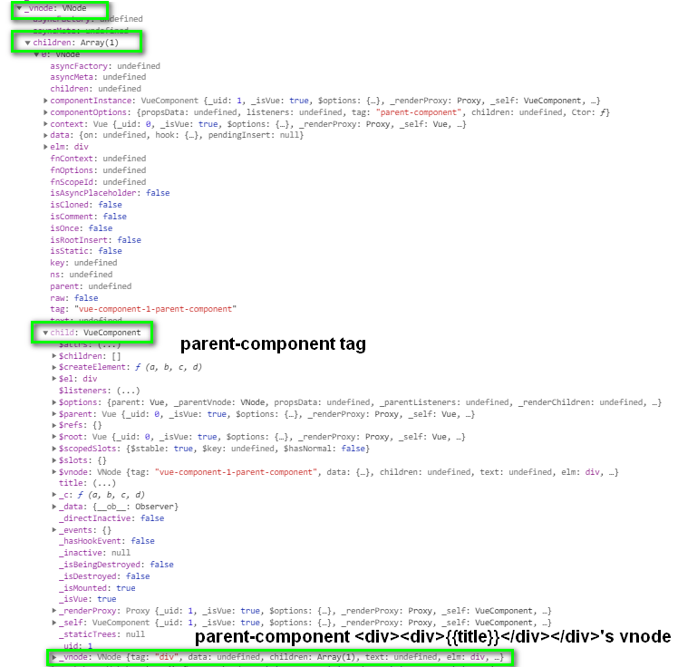

# vue js 练习，vuejs 源码调试笔记01

### 2020年7月5日

#### 父组件向子组件传递方法的方式

子组件的属性可以接收的方法

父组件在methods或者data中定义方法

父组件向子组件中的属性传递定义的方法

#### 父子组件关系的构成要素，（父组件）引入，注册，使用（子组件）

```html
<template>
  <div id="app">
    <p>这里是app组件</p>
    <!-- stpe3:使用 -->
    <home></home>
  </div>
</template>

<script>
// step1: 引入
import Home from './components/Home'
export default {
  name: 'App',
  // step2: 注册
  components: { Home }   
}
</script>
```


何时调用 new watcher(vm ,keypath,fn)

fn 是 updatecomponent()

vue  initstate 之前已经对template解析成了render,即知道了哪些dom或component标签接触了，在initState 方法中去完成数据变化侦测的依赖收集

render函数中的_c()函数，传入的是component标签时，会调用

_c("parent-component") --> creatElm('parent-component') -->createComponent('parent-component') -->init()--> vue.$mount --> mountComponent() --> new Watcher

vue 培训
上次也大致的给一小部分讲过这部分的内容，但效果不太好。借鉴上次的不成功的培训，这次做了一下调整。

臻善资源共享平台要做什么：可复用的组件
	直接发布的专案：创建项目，编写项目，构建，发布
	复用的组件：创建项目，编写项目，构建，发布到私仓
	可视化管理用于复用的组件
		提供界面上次编写
复用的组件和直接发布区别在哪	
	复用组件webpack后的样子，直接发布组件发布后的样子（上简单的chunk后的图）

	这个是webpack的功劳，介绍什么是webpack,为什么使用webpack（因为 js,css，html才能浏览器引擎执行）
webpack怎么用，他跟vuecli的关系
	什么是入口文件

	自加载函数
	
	什么是vuecli,会用到哪些内容

缺点或一些限制（不能做的事情）
以后可能的改进
	部门的组件风格不同的解决
		提供不同部门的vue脚手架模板
			这块需要具体部门的同事协助完成

讲的时候先串一边目录。

### 2020年6月29日

1 增加vNodeAndComponent.html ，用于调试vuejs的父子组件时，vNode的创建方式

比如代码

```html
<html>
   <head>
      <title>VueJs component basic</title>
      <script type = "text/javascript" src = "js/vue.js"></script>
   </head>
   <div id="components-demo">
       <parent-component></parent-component>
   </div>
  <script type = "text/javascript">
var componenta = {
        data:function () {
            return {
                title:"I'm parent component"
            }
        },
        template:'<div><div>{{title}}</div></div>'
    };
var app = new Vue(
    {
        el:"#components-demo",
        components:{
            "parent-component":componenta
        }
  }
);
console.log(app);
</script>
</html>
```

产生的代码字符串

```javascript
function anonymous( ) { with(this){return _c('div',{attrs:{"id":"components-demo"}},[_c('parent-component')],1)} }
```

其中`_c('parent-component')`会在调用时会把template:`'<div><div>{{title}}</div></div>'`部分转化为vnode 然后作为子树赋值到当前vnode树中。

VNode类型 有children 和 child 属性。 如果是预留的tag 比如 htmltag 或者 svgtag会在children中。如果遇到组件标签，比如这里的`parent-component`，会在child。

如下图 _vnode 是 `parent-component`标签这部分对应的vnode，它是在`_c('parent-component')`产生了_vnode.children[0].child这部分属性值




2019年12月16日
1 html 访问方式 
    E:/work/myproject/vue2/vuecharpter01/html/component_counter.html


2019年9月30日
Listening to Child Components Events
    查看 component_posts-events.html
    blog-post's v-on:enlarge-text="postFontSize += 0.1" is a custom event listener
    child component :button can emit event  to blog-post's v-on:enlarge-text listener  by v-on:click="$emit('enlarge-text')

    blog-post 是一个component ，但也可以又 像 html dom 元素 一样注册 v-on 等属性

用custom-input 替代 input 的 v-model  
    参考component_custom-input.html
        用 custom-input 自定义的event 通过  template 中的 v-on:input="$emit('input', $event.target.value)" 注册event 和 抛出 event
        <custom-input
            v-bind:value="searchText"
            v-on:input="searchText = $event"
          ></custom-input>
        template: `
            <input
            v-bind:value="value"
            v-on:input="$emit('input', $event.target.value)"
            >
        `          


###component 
1 basic component
2 component with method
3 dynamic component   :bind a data parameter as the component name

